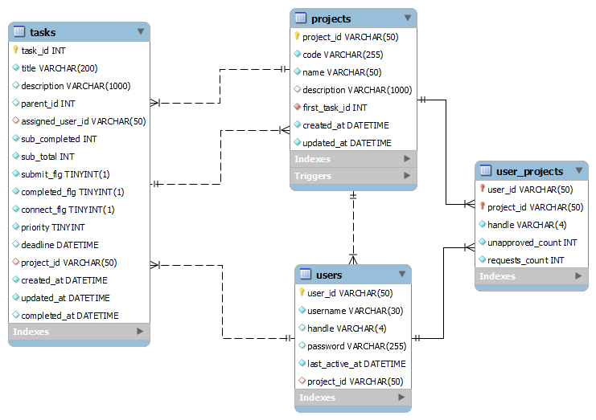
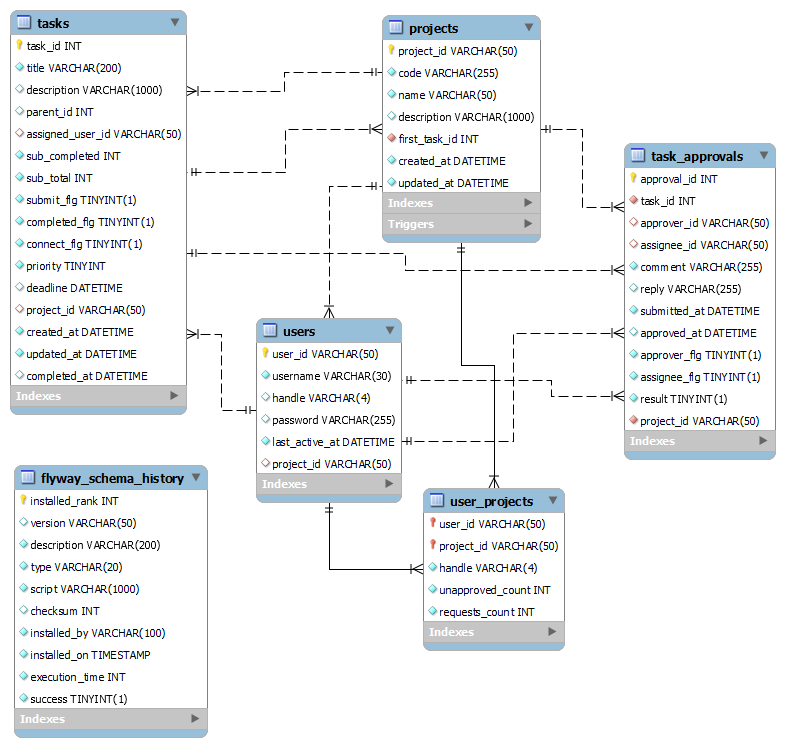

# TaskFlow
**タスク管理アプリケーション**

 

## URL

ユーザーID：`testuser`、パスワード：`pass` でログインできます

https://todo-flow-36bc64b25c1e.herokuapp.com/

 

## 制作背景

タスク管理において、作業の細分化や目先のタスクに意識が向きすぎることで、本来の目的や全体像を見失う課題を感じていました。
そこで、一つの大きな目標や目的を起点にタスクを階層的に管理し、**親子関係や全体像をわかりやすく可視化する**必要があると考えました。
本アプリでは、「今取り組んでいるタスクが何のための作業か」を常に把握でき、個人だけでなくチーム全体で**目標の共有と認識のズレを減らす**ことが可能になります。
また、チームメンバーが各々のタスクや流れを把握することで、スムーズに連携できる効果も期待できます。
全員が目的意識を持ち、**最短距離での課題解決を目指せるタスク管理**の実現を意識して開発を行いました。

 

## 機能一覧
| トップ画面 |　overview画面 |
| ---- | ---- |
|  |  |
| 自分の担当タスクが親タスク毎にカテゴライズされて一覧表示。  各タスクの直下のサブタスクも確認可能。| プロジェクト内の全てのタスクをフローチャート形式で表示。 クリックでタスク詳細表示、編集可能 任意の位置からプロジェクトの分離、結合が可能 |

| Approval画面 |　free画面 |
| ---- | ---- |
|  |  |
| タスクの承認処理を行う。 承認されないと承認必須のタスクは完了にならない。 過去の承認履歴が確認可能。 | 担当者が決まっていないタスクが一覧表示される。 ワンクリックでタスクを受け持つことができる。 |

### その他機能
  - **ユーザー認証**
  - **サイドバー**
    プロジェクト変更、セクションジャンプが可能
  - **タスクCRUD**
    タスクの編集、完了、削除は担当者及び責任者のみ可能
  - **プロジェクトCRUD**
    プロジェクトの編集、削除は、プロジェクト責任者のみ可能
  - **プロジェクトの分離、結合**
    関連するメンバー、承認情報も共に分離、結合される
  - **連鎖反応**
    タスクの削除や達成が連鎖。

 

## 使用技術

| カテゴリ       | 使用技術構成                                                           |
|----------------|----------------------------------------------------------------------|
| フロントエンド  | HTML/CSS, JavaScript, Bootstrap, Thymeleaf                      |
| バックエンド    | Java 17, Spring Boot 3.3.4        |
| 認証           | Spring Security |
| データベース    | MySQL |
| デプロイ       | Heroku, JawsDB   |
| その他ツール   | Git, GitHub                                           |

 

## ER図
#### メインの`projects` `tasks` `users`テーブルの相関図

 

#### 承認機能関連を含めた全体図

 
